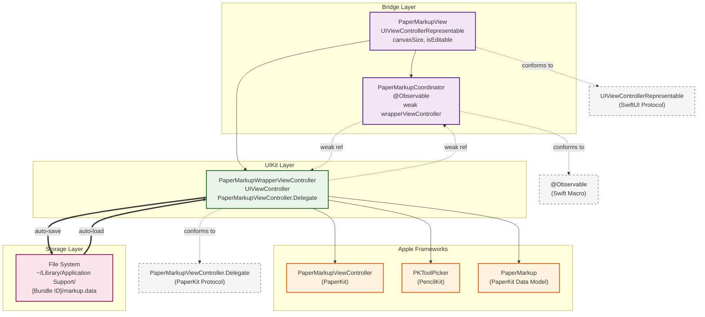

GIST referenced in this post: [PaperKit in SwiftUI PoC GIST](https://gist.github.com/clarkezone/68eb3ee13b5607782ceb2e20cece4ab3).

I've had an iPad app idea rattling around in my head for a while which would leverage [PencilKit](https://developer.apple.com/documentation/pencilkit) and a drawing canvas to enable a specific scenario that I think might form the basis of an app. I particularly like [Freeform](https://developer.apple.com/app-store/freeform/) and Lisa and I use it actively to colloborate on designs for our apps  and so my mental model was to use something like that approach.

{: width="650" }

Imagine my joy when I saw the WWDC 2025 session announcing [PaperKit](https://developer.apple.com/documentation/paperkit) at which you can watch here [https://developer.apple.com/videos/play/wwdc2025/285](https://developer.apple.com/videos/play/wwdc2025/285).

{: width="650" }

I watched this session with great anticipation and delight that the capabilities clearly form the basis of the Freeform.  The downside was that Apple chose to not provide a SwiftUI wrapper in this version of iOS. Because I wanted to start prototyping the app idea, I decided to build a quick PoC SwiftUI wrapper. Whilst it is definitely not comprehensive or production ready, it gets you up and running to play around with the basic functionality of PaperKit.

I coded back and forth with Claude Code for quite a whileto get the basics running and find a structure that was easy to understand whilst implementing the basic functionality of:

1. Displaying a PaperKit canvas with view constraints for sizing.
2. Toolbar controls to toggle between edit mode and view mode, undo last action and clear the canvas.
3. Display and management of drawing tools whilst in edit mode.
4. AccessoryItem for toolpicker for insertion of shapes and text.
3. Automatic loading and saving of current canvas data on app launch and exit.

The result was a working prototype:

{: width="250" }

One point to note about PaperKit: although it supports many of the canvas capabilities of Freeform, it isn't exhaustive; for example, it doesn't support the concept of adding connections between objects.  The other big limitation is there is no network syncing support.  This isn't surprising and I'm guessing it would be possible to build this using the delegate callbacks combined with a good peer-to-peer networking library.

## Architecture Overview

The integration between SwiftUI and PaperKit requires several layers to bridge the two frameworks effectively. Here's how the various components relate to each other:

## Implementation

Here's the complete implementation of the SwiftUI wrapper for PaperKit:

