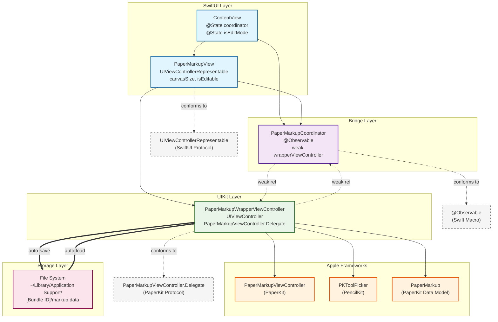

I've had an iPad app idea rattling around in my head for a while which would leverage pencil kit and a drawing canvas to enable a specific scenario that I think might form the basis of an app. I particularly like Freeform and so my mental model was to use something like that approach. Imagine my joy when I saw the session announcing PaperKit at WWDC (https://developer.apple.com/videos/play/wwdc2025/285).

I watched this session with great anticipation and delight at the capabilities that are clearly directly used in Freeform, but was a little saddened to see that there was no SwiftUI wrapper. Because I wanted to start prototyping the app idea, I decided to knock up a quick PoC for leveraging PaperKit in SwiftUI and I thought it might be helpful to share that. It's definitely not comprehensive or production ready but gets you up and running to play around.

## Architecture Overview

The integration between SwiftUI and PaperKit requires several layers to bridge the two frameworks effectively. Here's how the various components relate to each other:

## Implementation

Here's the complete implementation of the SwiftUI wrapper for PaperKit:

